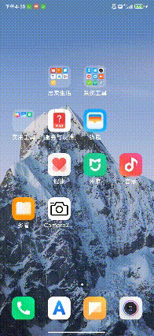

# 效果演示

# 已实现功能

1. 预览、拍照
2. 人脸识别
3. 调用系统相机拍照、录像、裁剪照片

# ToDo

1. Camera2 录像
2. 前后双摄实现

# 参考

- [android/camera-samples](https://github.com/android/camera-samples/tree/main)

- [Category: Effectivecamera - 稀有猿诉](http://toughcoder.net/blog/categories/effectivecamera/index.html)
- [Android 实现前后摄像头预览双开同时预览](https://blog.csdn.net/geyichongchujianghu/article/details/133588759)